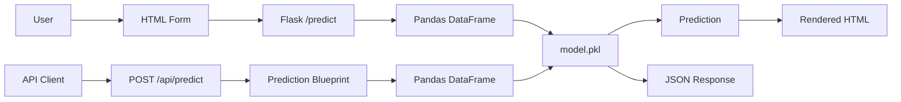
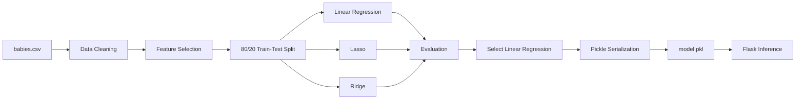
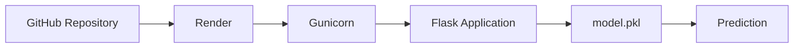

# Birth Weight Predictor

An end-to-end machine learning application that predicts infant birth weight from six maternal and pregnancy-related features. The project combines a Scikit-learn regression model with a Flask web application and a JSON REST API, and is deployed on Render.

**Live Demo:** https://birth-weight-predictor-jfxm.onrender.com  
**GitHub:** https://github.com/Divi-63/birth_weight_predictor

## Overview

The project follows a simple ML-to-deployment workflow:

- Train and compare regression models using Scikit-learn.
- Select Linear Regression for deployment.
- Serialize the trained model as `model.pkl`.
- Integrate the model with Flask for inference.
- Provide both a browser-based prediction form and a REST API.
- Deploy the application on Render using Gunicorn.

## Key Features

- Regression-based birth weight prediction
- Comparison of Linear Regression, Lasso, and Ridge
- Serialized Scikit-learn model using `model.pkl`
- Flask web interface for browser-based predictions
- Blueprint-based REST API at `/api/predict`
- Pandas DataFrame-based inference
- Gunicorn WSGI server
- Render deployment

## System Architecture



Both interfaces use the same trained `model.pkl` artifact for inference.

## Machine Learning Pipeline



### Dataset and Features

The model was trained using the `babies.csv` dataset containing maternal and pregnancy-related observations.

**Target:**
- `bwt` — infant birth weight

**Features:**
- `gestation`
- `parity`
- `age`
- `height`
- `weight`
- `smoke`

The dataset is used during model development in `model_training.ipynb` but is **not included in this GitHub repository**. The deployed application does not require the original dataset for inference because predictions are generated using the trained `model.pkl` artifact.

### Model Development

The training notebook:

1. Loads and cleans the dataset.
2. Removes missing observations and checks for duplicates.
3. Removes the `case` identifier column.
4. Separates the target (`bwt`) from the six input features.
5. Splits the data into training and test sets using an 80/20 split.
6. Trains Linear Regression, Lasso, and Ridge models.
7. Evaluates the models using R² and Mean Squared Error (MSE).
8. Selects Linear Regression for deployment.
9. Serializes the trained model to `model.pkl`.

## Flask Application

`app1.py` is the application entry point. It creates the Flask application and registers the prediction Blueprint under the `/api` prefix.

The project has two inference paths:

| Interface | Endpoint | Input | Response |
|---|---|---|---|
| Web application | `POST /predict` | HTML form data | Rendered HTML |
| REST API | `POST /api/predict` | JSON | JSON |

### Web Interface

The browser interface is implemented in `templates/index.html`.

The user enters the six model features into the HTML form. The form submits data to `POST /predict`, where Flask converts the submitted values into a Pandas DataFrame, runs model inference, and renders the prediction back into the page.

## REST API

### `POST /api/predict`

The REST API is implemented in `routes/predict.py` using a Flask Blueprint.

#### Example Request

```json
{
    "gestation": [258],
    "parity": [0],
    "age": [25],
    "height": [63],
    "weight": [170],
    "smoke": [0]
}
```

#### Example Response

```json
{
    "Prediction": 113.93
}
```

The numerical result depends on the supplied input and the trained model artifact.

The API converts the JSON payload into a Pandas DataFrame and enforces the expected feature order before calling `model.predict()`.

Expected columns:

```python
EXPECTED_COLUMNS = [
    "gestation",
    "parity",
    "age",
    "height",
    "weight",
    "smoke"
]
```

## Project Structure

```text
Birth_Weight_Predictor/
├── routes/
│   └── predict.py
├── templates/
│   └── index.html
├── .gitignore
├── app1.py
├── model.pkl
├── model_training.ipynb
├── requirements.txt
└── README.md
```

The original training dataset and local learning/development files are excluded from the repository.

## Local Setup

### 1. Clone the repository

```bash
git clone https://github.com/Divi-63/birth_weight_predictor.git
cd birth_weight_predictor
```

### 2. Create a virtual environment

On Windows:

```bash
python -m venv myvenv
myvenv\Scripts\activate
```

### 3. Install dependencies

```bash
python -m pip install -r requirements.txt
```

### 4. Run the application

```bash
python app1.py
```

The application uses port `10000` by default.

Open:

```text
http://127.0.0.1:10000
```

## Deployment

The application is deployed on Render.



Deployment flow:

**GitHub → Render → Gunicorn → Flask → `model.pkl` → Prediction**

Live application:

https://birth-weight-predictor-jfxm.onrender.com

## Technology Stack

| Category | Technologies |
|---|---|
| Language | Python |
| Data / ML | Pandas, NumPy, Scikit-learn |
| Backend | Flask, REST API, Blueprint routing |
| Serialization | Pickle (`model.pkl`) |
| Server | Gunicorn |
| Deployment | Render |

## Engineering Highlights

- Trained and compared three regression models — Linear Regression, Lasso, and Ridge — before selecting Linear Regression for deployment.
- Integrated the serialized Scikit-learn model into a Flask backend, converting incoming prediction inputs into a Pandas DataFrame before inference.
- Implemented two inference paths from a single model artifact: an HTML form for browser-based predictions and a Blueprint-based REST API for programmatic access.
- Separated API routing into a Flask Blueprint under the `/api` prefix.
- Deployed the Python ML application on Render using Gunicorn as the WSGI server.

## Future Improvements

- Add stronger input validation and clearer API error responses.
- Add automated unit and integration tests for prediction routes.
- Use cross-validation and more rigorous model evaluation.
- Add API documentation.
- Containerize the application with Docker.

## Author

**Divi-63**

GitHub: https://github.com/Divi-63
